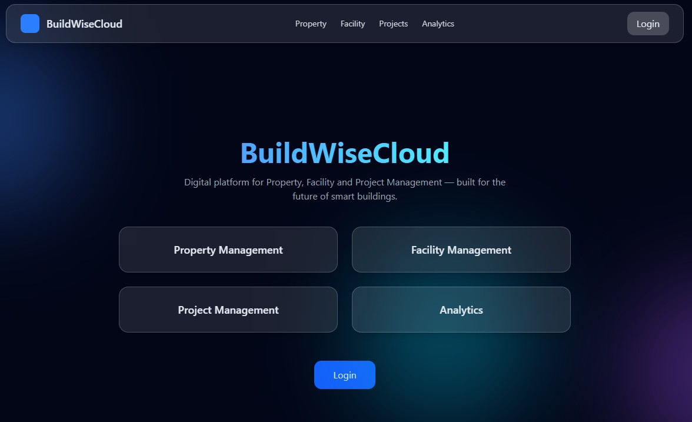

# 🟦 BuildWiseCloud

**Smart Maintenance. Simplified.**

---

## 🚀 Overview

BuildWiseCloud is a cloud-based CMMS (Computerized Maintenance Management System) designed to simplify property, facility, and maintenance operations.

Built from real-world experience in building maintenance, the platform focuses on clarity, efficiency, and scalability.

---

## 🧠 Core Modules

* 🏢 Property Management
* 🏗️ Facility Management
* 📋 Project Management
* 📊 Analytics

---

## ⚙️ Key Features (in development)

* Asset tracking
* Work order management
* Inspections & checklists
* Maintenance planning
* Vendor management
* Reporting & analytics

---

## 🖥️ Platform Preview

---

## 🛠️ Tech Stack

* Firebase
* JavaScript / TypeScript
* React (in progress)
* Cloud-first architecture

---

## ⚡ Status

🚧 Currently in active development

The platform is being built step by step, based on real operational needs and continuous iteration.

---

## 🎯 Vision

To create a modern, intuitive CMMS platform that transforms how maintenance is managed across industries.

---

## 🤝 Contact

📧 [lapadat@buildwisecloud.com](mailto:lapadata@buildwisecloud.com)

---

## ⭐ Notes

This project reflects a transition from field operations to SaaS product development.

Built with real experience.
Designed for real users.
